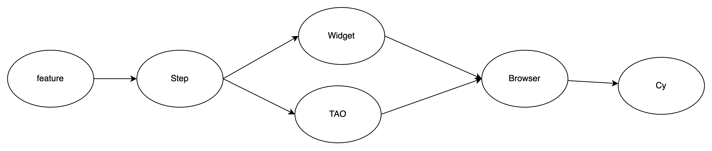

# TeDe

TEst DEfinitions. A dual repository (JavaScript and Python) containing useful code for testing.

## Usage

To be added.

## Developer Notes

(remaining from the template repository)

### GitHub workflow

The workflow requires the following variables to be defined:

- `secrets.BOT_GITHUB_TOKEN`
- `secrets.BOT_GITHUB_KEY`

### Package Initialization

When creating a new repository from this template, follow the items on the following checklist:

- [ ] In `pyproject.toml` update `project.name`, `project.description`, and `project.classifiers`
        (if applicable).
- [ ] Add Python dependencies to `pyproject.toml`. The `requirements*.txt` files can be generated
        automatically using `pip-compile`.
- [ ] In `./src/py` replace the `templator` directory with your Python package name.
- [ ] Install `pre-commit` if not already present (e.g. `pip install pre-commit`).
- [ ] In `package.json`, update `"name"` and `"description"`.
- [ ] Add JS/TS dependencies as usual (`npm install <pkg>` or `npm install --save-dev <pkg>`).

### Pre-Commit Hooks

The pre-commit hooks are managed by the `pre-commit` tool (see [docs](https://pre-commit.com/)) in **both** Python
and JavaScript/TypeScript. In order to set up the pre-commit hooks in the JS/TS development flow similar to `husky`,
the `bootstrap.js` script was added. With `pre-commit` installed, running the `bootstrap.js` script is equivalent
to `husky install`. Note that the hooks are only activated when the package is installed locally (`npm install`)
and not when installed as a dependency.

## Writing tests

### Common architecture



### Browser object

There are 4 types of methods in the browser object:

1. actions
2. assertions
3. getters
4. utils

Browser actions:

- `click`
- `clickOnText`
- `check`
- `uncheck`
- `select`
- `setInputValue`
- `uploadFileFromFilePath`
- `waitForVisible`
- `waitForDisappear`
- `waitForHide`
- `waitForExist`
- `waitForValue`

Browser assertions:

- `assertText`
- `assertInputValue`
- `assertChecked`
- `assertSelected`
- `assertCSS`
- `assertVisible`
- `assertHidden`
- `assertMissing`

Browser getters:

- `getInputValue`
- `getElementText`
- `getAttribute`
- `getCssProperty`
- `isVisible`
- `isSelected`
- `isChecked`
- `isExisting`

Browser util methods:

- `retry`
- `dispatchEvent`
- `execute`

### Suggestions

- Try using getters as little as possible and use assertions instead:

```js
// Wrong:
widget.browser.retry(() => {
  return widget.browser.getElementText(selector).then((elementText) => {
    return elementText === "expected text";
  })
});

// This is much better: 
widget.browser.assertText(selector, "expected text");
```

- If you still need to use `browser.retry` somewhere, it has to be one whole step. Please do not mix it with other actions:

```js
widget.browser.retry(() => {
  return widget.checkSomethingOnTheServerSide().then((isReady) => {
    return Boolean(isReady);
  })
});

// Move code below to the next step:
widget.doSomeOtherThings();
widget.doSomeAnotherThings();
```
